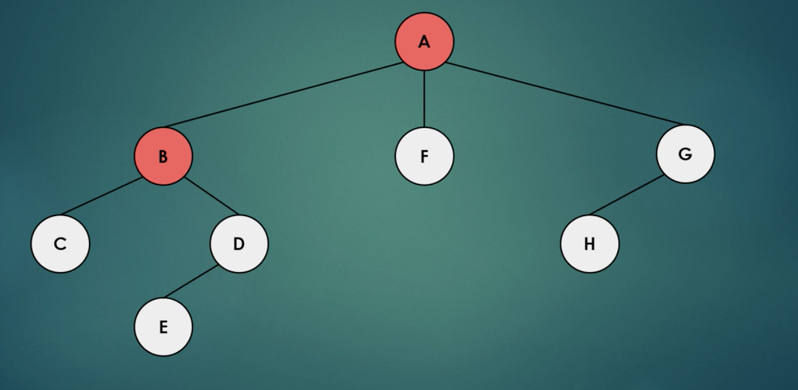
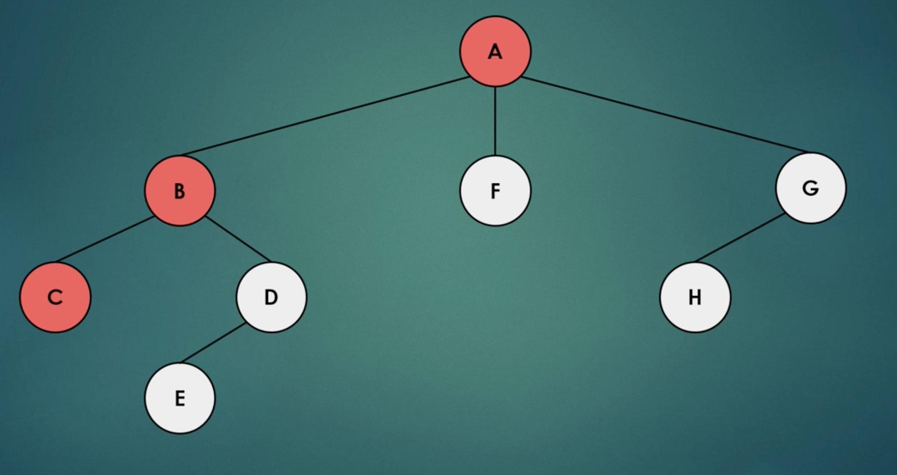

<h1> Depth First Search </h1>

In this tutoral, we will be learning about Depth-First Search.  Depth-first search is an algorithm for searching tree or graph data structures.   

<br>
Imagine you're the man in this maze.  
<br>

</img>
<br>
<br>
<p>You wouldn't search all the paths at once, only traveling a little bit along each one before turning back, like you would in Breadth-First Search. That would be silly.  You would probably travel all the way along one path and then travel back to try the next path.  </p>


<p>DFS starts at the tree root, or a node of the graph, and searches all the way down each path to find all the nodes along that path before backtracking  to start along the next path.  This is a bit more efficient than Breadth-First Search, which searches level-by-level. One common use of it is, you guessed it, in mazes. </p>

<p>Below is the sequence of nodes found using Depth-First search.  The algorithm travels all the way down one path before turning back.</p>  


</img>
</img>
</img>


Next, create three classes.  
1. Vertex.java - This will create the vertices, or nodes, of your data tree which will be used to test your Depth First Search algorithm. 
2. DFS.java - This is where you will implement your Depth-First Search algorithm.
3. App.java - This is where you will call your Depth-First Search algorithm and use it to find all nodes in your data tree.

In Vertex.java:
Initialize your data variable and a boolean visited to indicate if you have visited the current node or not.  Then, create a neighborList to keep track of the current node's neighbor nodes.  
```
  private int data;
	private boolean visited;
	private List<Vertex> neighborList;
	
	public Vertex (int data) {
		this.data = data;
		this.neighborList = new ArrayList<>();
	}
```

Next, right-click and select Source -> Generate Getters and Setters to generate getters and setters for your three variables. 

```
public int getData() {
		return data;
	}

	public void setData(int data) {
		this.data = data;
	}

	public boolean isVisited() {
		return visited;
	}

	public void setVisited(boolean visited) {
		this.visited = visited;
	}

	public List<Vertex> getNeighborList() {
		return neighborList;
	}

	public void setNeighborList(List<Vertex> neighborList) {
		this.neighborList = neighborList;
	}
	
	public void addNeighborVertex(Vertex vertex) {
		this.neighborList.add(vertex);
	}
	
	public String toString() {
		return ""+this.data;
	}
```
Next, go to DFS.java.

First, initialize your stack.  This will be the stack of nodes you have to visit.  Your algorithm will add and delete values from this stack as it travels along each path. 

```
private Stack<Vertex> stack;
	
	public DFS() {
		this.stack = new Stack<>();
	}
```

<p>Next, we're going to implement the algorithm that travels along each path.  </p>

<p>For each vertex, we're going to travel down each path and check if the nodes in that path have been visited.  If not, we're going to add it to our stack of vertices we need to visit.  </p>

<p>We will do this until all the vertices have been visited.</p>

<p>Our vertexList is the list of all vertices we have currently found.  For each vertex, we call "dfsWithStack" to travel along the path of that vertex. </p>

```
public void dfs(List<Vertex> vertexList) {
		
		for (Vertex v : vertexList) {
			if (!v.isVisited()) {
				v.setVisited(true);
				dfsWithStack(v);
			}
		}
	}
```
<p>The following code is the code for traveling along a single path.  While the stack isn't empty, we "pop" the top node from the stack and travel down that path.  After that, we set all those nodes to "visited" and backtrack to start along the next path.</p> 

```
private void dfsWithStack(Vertex rootVertex) {
		this.stack.add(rootVertex);
		rootVertex.setVisited(true);
		
		while (!stack.isEmpty()) {
			Vertex actualVertex = this.stack.pop();
			System.out.print(actualVertex + " " );
			
			for (Vertex v : actualVertex.getNeighborList()) {
				if (!v.isVisited()) {
					v.setVisited(true);
					this.stack.push(v);
				}
			}
		}
	}
```


<p>Next, we're going to test our algorithm.  Open App.java and add the following code:</p>
```
DFS dfs = new DFS();
		
		Vertex vertex1 = new Vertex(1);
		Vertex vertex2 = new Vertex(2);
		Vertex vertex3 = new Vertex(3);
		Vertex vertex4 = new Vertex(4);
		Vertex vertex5 = new Vertex(5);
		
		vertex1.addNeighborVertex(vertex2);
		vertex1.addNeighborVertex(vertex4);
		vertex4.addNeighborVertex(vertex5);
		vertex2.addNeighborVertex(vertex3);
```
The first line initializes the Breadth-First Search Algorithm and the subsequent lines create a data tree with the root node vertex1.

The following line gives your Depth First Search a list to store the vertices it has currently found. 
```
List<Vertex> list = new ArrayList<>();
```

Next, add the following line.  This will run your depth-first search algorithm.
```
dfs.dfs(list);
```


Output window:
1 4 5 2 3 


Success!  Our Depth-First Search Algorithm found all the nodes!

