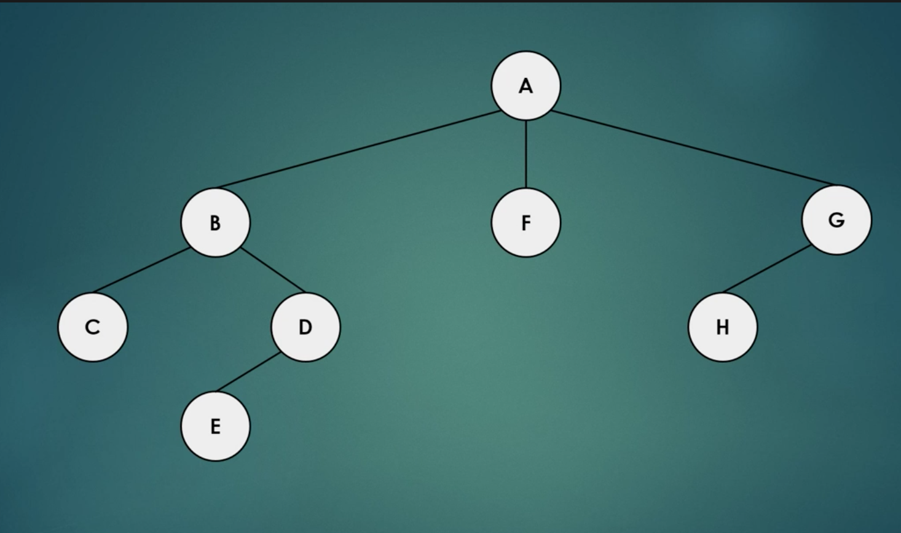

<h1> Depth First Search </h1>

In this tutoral, we will be learning about Depth-First Search.  Depth-first search is an algorithm for searching tree or graph data structures.  It starts at the tree root, or a node of the graph, and searches all the way down each path to find all the nodes along that path before backtracking 
to start along the next path.  This is a bit more efficient than Breadth-First Search, which searches level-by-level.  One easy-to-conceptualize use of it is in mazes.  DFS can be used to efficiently find routes out of a maze. 

</img>

For example, in the above tree, the algorithm would first find the A in the first row, then look for the B, F, and G in the next row.  Next, it would stop searching along the F branch, because there would be no more nearby, or "neighbor" nodes.  Then, the algorithm would continue searching along the other two branches, finding the "C", "D", and "H".

Next, create three classes.  
1. Vertex.java - This will create the vertices, or nodes, of your data tree which will be used to test your Breadth First Search algorithm. 
2. BFS.java - This is where you will implement your Breadth-First Search algorithm.
3. App.java - This is where you will call your Breadth-First Search algorithm and use it to find all nodes in your data tree.

In Vertex.java:
Initialize your data variable and a boolean visited to indicate if you have visited the current node or not.  Then, create a neighborList to keep track of the current node's neighbor nodes.  
```
  private int data;
	private boolean visited;
	private List<Vertex> neighborList;
	
	public Vertex (int data) {
		this.data = data;
		this.neighborList = new ArrayList<>();
	}
```

Next, right-click and select Source -> Generate Getters and Setters to generate getters and setters for your three variables. 

```
public int getData() {
		return data;
	}

	public void setData(int data) {
		this.data = data;
	}

	public boolean isVisited() {
		return visited;
	}

	public void setVisited(boolean visited) {
		this.visited = visited;
	}

	public List<Vertex> getNeighborList() {
		return neighborList;
	}

	public void setNeighborList(List<Vertex> neighborList) {
		this.neighborList = neighborList;
	}
	
	public void addNeighborVertex(Vertex vertex) {
		this.neighborList.add(vertex);
	}
	
	public String toString() {
		return ""+this.data;
	}
```
Next, go to BFS.java.

First, initialize your queue.  This will be the list of nodes you have to visit.  Your algorithm will add and delete values from this queue. 

```
Queue<Vertex> queue = new LinkedList<>();
		
		root.setVisited(true);
		queue.add(root);
```

Next, we're going to implement the algorithm.  

/* 2 */ For each vertex, we're going to get the list of neighbors and check if that neighbor has been visited.  If not, we're going to add it to our queue of vertices we need to visit.  

We will do this until the queue of vertices we need to visit is empty (/* 1 */).

```
/* 1 */ while (!queue.isEmpty()) {
			Vertex actualVertex = queue.remove();
			System.out.println(actualVertex+" ");
			
			/* 2 */ for (Vertex v : actualVertex.getNeighborList()) {
				if (!v.isVisited()) {
					v.setVisited(true);
					queue.add(v);
				}
			}
			
		}
```

Next, we're going to test our algorithm.  Open App.java and add the following code:
```
BFS bfs = new BFS();
		
		Vertex vertex1 = new Vertex(1);
		Vertex vertex2 = new Vertex(2);
		Vertex vertex3 = new Vertex(3);
		Vertex vertex4 = new Vertex(4);
		Vertex vertex5 = new Vertex(5);
		
		vertex1.addNeighborVertex(vertex2);
		vertex1.addNeighborVertex(vertex4);
		vertex4.addNeighborVertex(vertex5);
		vertex2.addNeighborVertex(vertex3);
```
The first line initializes the Breadth-First Search Algorithm and the subsequent lines create a data tree with the root node vertex1.

Next, add the following line.  This will run your breadth-first search algorithm.
```
bfs.bfs(vertex1);
```


Output window:
1 
2 
4 
3 
5 


Success!  Our Breadth-First Search Algorithm found all the nodes!

